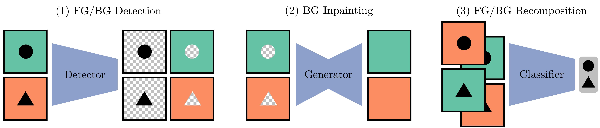

# AutoBackSwap: Automated Background Swapping for Robustness against Spurious Backgrounds

This repository contains source code of the experiments for the paper:

[_Automated Background Swapping for Robustness against Spurious Backgrounds_](https://arxiv.org/abs/2606.32018)

Classifiers based on Deep Neural Networks exhibit strong performance across domains, yet can fail catastrophically if they rely on spurious correlations, i.e., features that are predictive of the target label in the training data but are not causally linked and thus fail to generalize. For the vision domain, many such spurious correlations manifest themselves within the background of the image, where only the foreground is predictive of the class label. In this paper, we introduce Automated Background Swapping (AutoBackSwap) to reduce the reliance of classifiers on such spurious backgrounds. AutoBackSwap uses a secondary network to disentangle the foreground and background, followed by infilling to synthesize complete backgrounds, and finally combines different foregrounds and inpainted backgrounds to augment the training data. We find that patch-wise labeling of just a few hundred samples suffices to train the secondary network and automatically augment the full training dataset on challenging image classification tasks. In contrast to many previous methods, AutoBackSwap proves very effective even if there is not a single sample in the training data breaking the spurious correlation. Across a range of image classification tasks with spurious backgrounds, AutoBackSwap consistently outperforms prior methods.

<p align="center">  </p>


```bibtex
@article{roder2026abs,
    title={Automated Background Swapping for Robustness against Spurious Backgrounds}, 
    author={Cesar Roder and Kajetan Schweighofer},
    year={2026},
    journal ={arXiv preprint arXiv:2606.32018}
}
```

---

## Repository Structure

```text
.
├── AOT-GAN-for-Inpainting/    # AOT-GAN submodule
├── data/                      # Datasets
├── methods/                   # Method implementations
│   ├── ours/                  # AutoBackSwap implementation
│   └── ...
├── ablations/                 # Ablation scripts
├── run.py                     # Main entry point
└── baselines.md               # baseline method commands

```

---

# Setup Instructions

## 1. Clone repository

```bash
git clone --recursive https://github.com/cesro7/spur-corr.git
```
---


## 2. AOT-GAN dependency

The repository uses AOT-GAN for background infilling.

Initialize submodules:

```bash
git submodule update --init --recursive
```

Download the pretrained generator weights from:

https://drive.google.com/drive/folders/1bSOH-2nB3feFRyDEmiX81CEiWkghss3i?usp=sharing

Place the downloaded checkpoint at:

```text
AOT-GAN-for-Inpainting/G0000000.pt
```

---

## 3. Environment setup

Create a Python environment (version **3.12**) and install the project dependencies:

```bash
pip install -r requirements.txt
```

> **Note:** `PyTorch` is **not** included in `requirements.txt` because the installation depends on your hardware (CPU/CUDA version). Install it separately. The project uses **torch==2.11.0+cu126** and **torchvision==0.26.0+cu126**.

---

## 4. Dataset setup

To download and setup the datasets see [data/README.md](data/README.md).

---

# Reproducing Results

The commands below reproduce the results reported in the paper. The paper reports results averaged over multiple random seeds, while the commands below are configured to run with `--random_seed=0`. To reproduce results with a different random seed, change the value of the `--random_seed` argument in each command and rerun the corresponding steps.

By default, the commands reproduce the ResNet50 results. To reproduce the ViT results instead, simply add the argument `--model_class="vit"` to each command. You can also change the output directory by setting the `--results_dir`argument. CUDA compilation and mixed-precision training are enabled by default (`--cuda_optimizations=true`); to disable both, set `--cuda_optimizations=false`.

After training completes, the evaluation results can be found in the corresponding `<results_dir>/<run_label>/test_accuracies.txt` file.


## Waterbirds (Table 1)

```bash
DEVICE="cuda:0"
WB_USE_MINORITY="true"  # Change to "false" to exclude minority samples from the training data
```
Train detector:

```bash
python run.py \
--device=$DEVICE \
--dataset_type="waterbird" \
--mode="ours_detector" \
--detector_dataset="waterbirds_from_segmentation" \
--waterbirds_use_minority=$WB_USE_MINORITY \
--random_seed=0
```

Generate disentangled foreground/background data:

```bash
python run.py \
--device=$DEVICE \
--dataset_type="waterbird" \
--mode="ours_generate" \
--detector_dataset="waterbirds_from_segmentation" \
--waterbirds_use_minority=$WB_USE_MINORITY \
--random_seed=0
```

Train classifier:

```bash
python run.py \
--device=$DEVICE \
--dataset_type="waterbird" \
--mode="ours" \
--detector_dataset="waterbirds_from_segmentation" \
--waterbirds_use_minority=$WB_USE_MINORITY \
--random_seed=0 \
--run_label="ours"
```
---

## Spawrious (Table 2)

You can choose which Spawrious variant to use:
```bash
DEVICE="cuda:0"
VARIANT="o2o_easy"
```

Available variants:

```text
o2o_easy
o2o_medium
o2o_hard
m2m_easy
m2m_medium
m2m_hard
```

Train detector:

```bash
python run.py \
--device=$DEVICE \
--dataset_type="spawrious/${VARIANT}" \
--mode="ours_detector" \
--detector_dataset="spawrious_from_segmentation" \
--random_seed=0
```

Generate disentangled foreground/background data:

```bash
python run.py \
--device=$DEVICE \
--dataset_type="spawrious/${VARIANT}" \
--mode="ours_generate" \
--detector_dataset="spawrious_from_segmentation" \
--random_seed=0
```

Train classifier:

```bash
python run.py \
--device=$DEVICE \
--dataset_type="spawrious/${VARIANT}" \
--mode="ours" \
--detector_dataset="spawrious_from_segmentation" \
--random_seed=0 \
--run_label="ours"
```
---
## Spurious Vehicles Experiments (Table 3)

```bash
DEVICE="cuda:0"
```

Train detector:

```bash
python run.py \
--device=$DEVICE \
--dataset_type="spurious_vehicles_m2m" \
--mode="ours_detector" \
--detector_dataset="spurious_vehicles_from_segmentation" \
--random_seed=0
```

Generate disentangled foreground/background data:

```bash
python run.py \
--device=$DEVICE \
--dataset_type="spurious_vehicles_m2m" \
--mode="ours_generate" \
--detector_dataset="spurious_vehicles_from_segmentation" \
--random_seed=0
```

Train classifier:

```bash
python run.py \
--device=$DEVICE \
--dataset_type="spurious_vehicles_m2m" \
--mode="ours" \
--detector_dataset="spurious_vehicles_from_segmentation" \
--random_seed=0 \
--run_label="ours"
```
---

# Ablation Studies

## Quality of Auxiliary Dataset (Figure 2)

Run:

```bash
bash ablations/ours_dataset_patch_size.sh
```

To create the plot use:

```text
ablations/evaluate_ablation_ds_pr.ipynb
```

---

## Biased Auxiliary Mask Labels (Figure 3)

Run:

```bash
bash ablations/ablation_auxiliary_masks.sh
```

---

## Background Infilling Strategy (Figure 4)

Run:

```bash
bash ablations/ablation_infilling.sh
```

---

## Baseline Methods

To keep this README concise and improve readability, the commands for all baseline methods are provided separately in [baselines.md](baselines.md).

---
